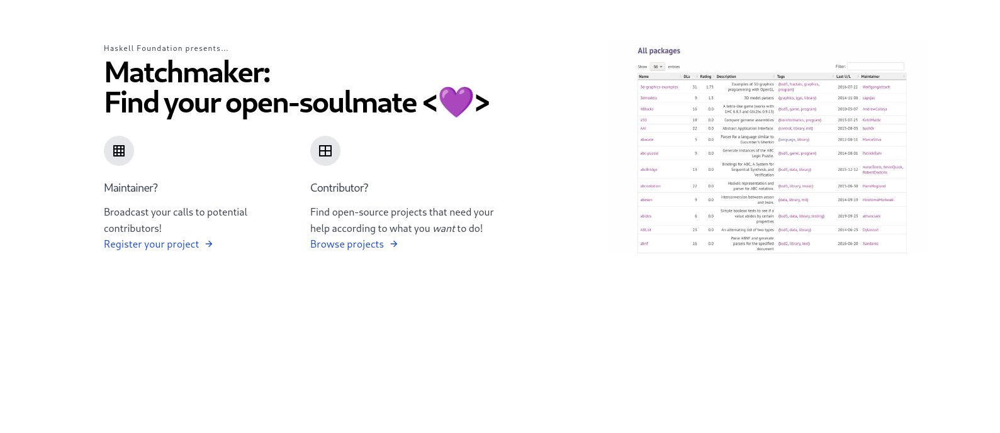

# Matchmaker [![CI-badge][CI-badge]][CI-url] ![simple-haskell][simple-haskell]



## Description

*Matchmaker* is a project of the Haskell Foundation to help open-source maintainers and contributors find each-other,
and provide a smoother experience for people wishing to invest themselves in the opens-source Haskell ecosystem.

## Prerequisites

* PostgreSQL 12 or higher
* GHC 8.10.4
* Yarn 1.22 or higher

*Note*
There is a `shell.nix` file provided for convenience. However it is far from perfect. Notably, it does not install
GHC 8.10.4, nor manages a local installation of PostgreSQL (yet). Don't load this shell file with `--pure`.

## Run the backend

```bash
$ make deps
$ make build
$ make db-setup
$ make start
```
### Frontend

```bash
$ make assets-deps
$ make assets-build # or assets-watch if you're working on CSS/JS
```

[simple-haskell]: https://img.shields.io/badge/Simple-Haskell-purple?style=flat-square
[CI-badge]: https://img.shields.io/github/workflow/status/haskellfoundation/matchmaker/CI?style=flat-square
[CI-url]: https://github.com/haskellfoundation/matchmaker/actions
